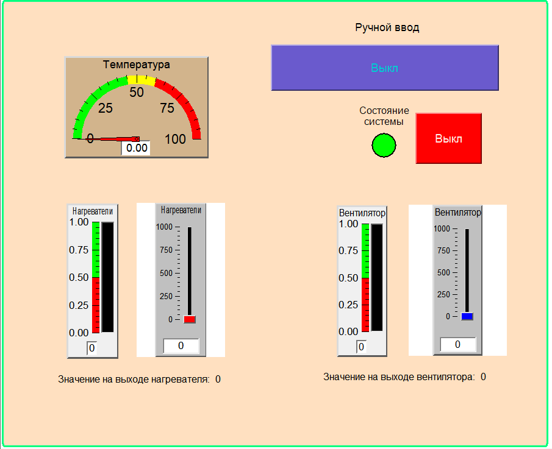

# Программирование стенда Owen PLC100

## Необходимое программное обеспечение

Перед началом работы требуется установить следующее ПО:

### Основные инструменты  

1. **CoDeSys V2**  
   [CoDeSys V2](https://owen.ru/product/codesys_v2)  
   Используется для:  
   - Разработки кода для ПЛК Owen PLC100  
   - Установки соединения с контроллером  
   - Отладки программ  
   - Создания мнемосхем (в данном проекте будет использоваться альтернативное решение)  

2. **MasterSCADA 3.X**  
   [MasterSCADA](https://owen.ru/product/master_scada)  
   - будем использовать старую версию 3.Х, так что придётся немножко пострадать;  

### Конфигураторы оборудования

3. **Конфигураторы модулей**  
   [Архив конфигураторов](https://owen.ru/soft/archive_configurator)  
   Для работы с:  
   - МВА8 (аналоговые модули)  
   - МВУ8 (дискретные модули)  
   
   Функционал:  
   - Настройка параметров модулей  
   - Просмотр текущих конфигураций  
   - Диагностика подключенных устройств  

### Драйверы и терминалы

4. **Драйверы для Z-397**  
   [Скачать с IronLogic](https://ironlogic.ru/il_new.nsf/htm/ru_usb485)  
   Требуется для:  
   - Преобразования USB-RS485  
   - Обеспечения стабильной связи с оборудованием  

5. **CoolTerm**  
   [Официальный сайт](https://coolterm.en.lo4d.com/windows)   
   Используется как:  
   - Терминал для мониторинга RS-485  
   - Анализа передаваемых пакетов  
   - Отладки протокола обмена  

## Дополнительные ресурсы

- [Официальный форум поддержки](https://owen-russia.ru/airdqa/kakoj-konfigurator-nuzhen-dlya-nastrojki-oven-plk100/)
- [Документация PLC100](https://owen.ru/uploads/re_plc100_1437.pdf)
- [Библиотеки и примеры кода](https://owen.ru/support)
## Программирование
Для начала нам необходимо установить соединение с ПЛК. В документации написан IP-адрес.  


>Панель управления\Сеть и Интернет\Сетевые подключения. Выбираем для нового подключения IPv4.
### Языки программирования
Чтобы запрограммировать ПЛК, нужно выбрать язык для стенда. Какие языки вообще бывают?
Для программирования контроллеров (ПЛК) используются стандартизированные языки, которые можно разделить на графические и текстовые. Каждый из них имеет свою область применения и особенности.

1. LD (Ladder Diagram) – Релейно-контактная логика
Графический язык, имитирующий электрические схемы на реле. Разработан для удобного перехода с классической релейной автоматики на ПЛК.

*Применение:*

Управление дискретными сигналами (вкл./выкл.).

Простые логические операции (AND, OR, NOT).

2. FBD (Function Block Diagram) – Функциональные блоки
Графический язык, где программа строится из соединенных блоков (аналог электронных схем).

*Применение:*

Обработка аналоговых сигналов.

Реализация ПИД-регуляторов и других сложных алгоритмов.

3. SFC (Sequential Function Chart) – Диаграмма состояний
Графический язык, описывающий процесс как последовательность шагов, переходов и условий.

*Применение:*

Автоматизированные линии с четкими этапами работы.

Управление циклическими процессами.

4. IL (Instruction List) – Список инструкций
Текстовый низкоуровневый язык, похожий на ассемблер.

*Применение:*

Оптимизированный код для задач с жесткими требованиями к производительности.

Устарел, но иногда используется в legacy-системах.

5. ST (Structured Text) – Структурированный текст
Высокоуровневый текстовый язык, похожий на Pascal или C.

*Применение:*

Сложные математические расчеты.

Обработка данных и реализация нестандартных алгоритмов.

6. CFC (Continuous Function Chart) – Расширенный FBD
Графический язык, позволяющий свободно размещать блоки и задавать порядок их выполнения.

*Особенности:*

Удобен для систем с обратными связями (например, ПИД-регуляторы).

Прост в освоении, но требует аккуратности из-за риска ошибок в логике.

Выбор языка
Для большинства современных задач ST (Structured Text) является оптимальным выбором благодаря своей гибкости и читаемости. Он подходит для сложных алгоритмов и легко осваивается теми, кто знаком с Pascal.
### CoDeSys
Настройка проекта
После выбора ПЛК и языка ST (Structured Text) интерфейс выглядит следующим образом:
  
Слева выбираем ресурсы -> конфигурацию ПЛК.  
  
В самом меню конфигурации можно задать имя дискретным вводам и выводам, а так же поменять параметры. В дальнейшем нам необходимо будет добавить 2 модуля. Для начала попробуем запрограммировать и определить работоспособность ПЛК.
Пример программы, для тестирования соединения ПЛК с компьютером:
Проверим работоспособность ПЛК с помощью простой программы, которая переключает выход каждую секунду.
``` ST
ton1(IN := NOT ton1.Q, PT := T#1S);
IF ton1.Q THEN
    flag := NOT flag;
END_IF
out1 := flag;
```
Переменные:
``` ST
ton1:=TON; flag: BOOL := FALSE;
```
Как это работает:
Таймер ton1 сбрасывается каждую секунду (T#1S).
При срабатывании таймера меняется состояние флага flag.
Выход out1 повторяет состояние флага. 
> Чтобы подключиться к ПЛК можно на панели выбрать Онлайн -> Подключение или сочетание клавиш Alt + F8.

Добавляем 2 модуля МВА8 и МВУ8. Заходим в конфигурацию ПЛК и нажимаем на пустое пространство и добавляем ModBus (Master).  
  
Заменяем RS-232 на RS-485-1  
  
Выбираем 2 подэлемента MVA8 и MVU8 и настраиваем параметры модуля OWEN_MV*8 и RS-485-1  
  
Значения для модулей необходимо сконфигурировать (узнать) через приложение  
  
> При подключении к модулям необходимо выбрать доступный COM-порт. Адрес устройства выбирайте либо заводской, либо уже предустановленный. При необходимости снимите крышку и осуществите сброс до заводских настроек.  
 
  
В приложении настраивается тип подключаемого устройства на конкретный вход (в нашем случае термопара типа К) и сетевые параметры прибора. Они должны совпадать с параметрами, заданными в CoDeSys.
### Написане кода для стенда
Для стенда оптимальным значением является 50 градусов. Можно от этого отталкиваться и в зависимость от температуры менять состояние выходов.
>Выходы на MVU8, не логические в отличи от выходов ПЛК. Их значение варьируется от 0-1000. Тем самым можно создавать ШИМ на выходах.
При подключении отслеживаем значения переменных и температуру. Если всё работает верно, то можно переходиться к следующему пункту.
## Создание мнемосхемы в MasterSCADA
Чтобы передавать значения с ПЛК нам нужно сделать маленькую подготовку проекта.
- Заходим в настройки целевой платформы и ставим галку в пункте: "Загружать символьный файл"

- В опциях проекта выбираем вкладку "Символьная конфигурация" выберем всё и нажимаем "Настроить символьный файл..." и так же выбираем всё.
  
- После всех процедур заливаем прошивку на ПЛК и создаём загрузочный проект.  
  
- Закрываем проект и ищем на своём компьютере папку CoDeSysOPC. Здесь мы создадим свой ОРС сервер, который добавим в MasterSCADA.    
  
Создаём новый файл, выбираем ПЛК и создаём соединение по ethernet.  
  

Всё готово для создания мнемосхемы, можно переходить в MasterSСADA.
### Настройка дерева системы.
Добавим в дерево системы компьютер, используя контекстное меню. Связь с прибором будем осуществлять через ОРС сервер. Произведем поиск доступных на компьютере ОРС серверов. Нам нужен "OPC Server for CoDeSys V...". Добавляем переменные (они должны совпадать с переменными, которые вы добавляли или изменяли в CoDeSys). Вот так должно выглядеть результат добавления сервера ОРС.  
  
Настройка дерева объектов
Объект – это элемент программы, предназначенный для размещения в нем других элементов, переменных и функциональных блоков, а также других объектов.
Объекты добавляют через контекстное меню Объекта. Добавим 1 объект PLC и 5 подобъектов: температура, состояние установки, нагреватели,вентилятор, задачи.(В зависимости от программы и того, что вы хотите видеть на мнемосхеме можно добавить ещё несколько объектов).Чтобы установить связи между объектами, достаточно перетянуть их на параметр, который хотим добавить на мнемосхему.  
  
Поскольку состояние выходов на МВУ8 меняется от 0 до 1000, то можно добавить деление на 1000 для красоты. Для этого справа снизу выбираем вычисления -> деление.  
  
Перетаскивая значения на делимое, а так же выставив константу во вкладке опрос, можно получить частное = входное значение / 1000.
Для объекта задачи выбираем правой кнопкой мыши вставить -> команду. Их нужно соединить с выходами ПЛК. С помощью изменения значений на мнемосхеме можно передавать данные на ПЛК.  
Теперь нам необходимо нарисовать мнемосхему.  
Перетаскивая объекты на мнемосхему можно выводить значения с помощью текста. Для более приятного отображения можно добавить разные элементы. Все элементы выбираются в палитре.  
  
В свойствах можно изменить объекты для лучшей визуализации. В конце необходимо настроить связи между объекта на мнемосхеме и объектами в дереве объектов. Для этого достаточно перенести объекты на конкретный объект на мнемосхеме или задать через свойства объекта -> Динамизация входных/входных значений. Пример мнемосхемы представлен ниже.
  
После тестирования и корректности выводимых данных тестирование стенда можно считать завершённым.