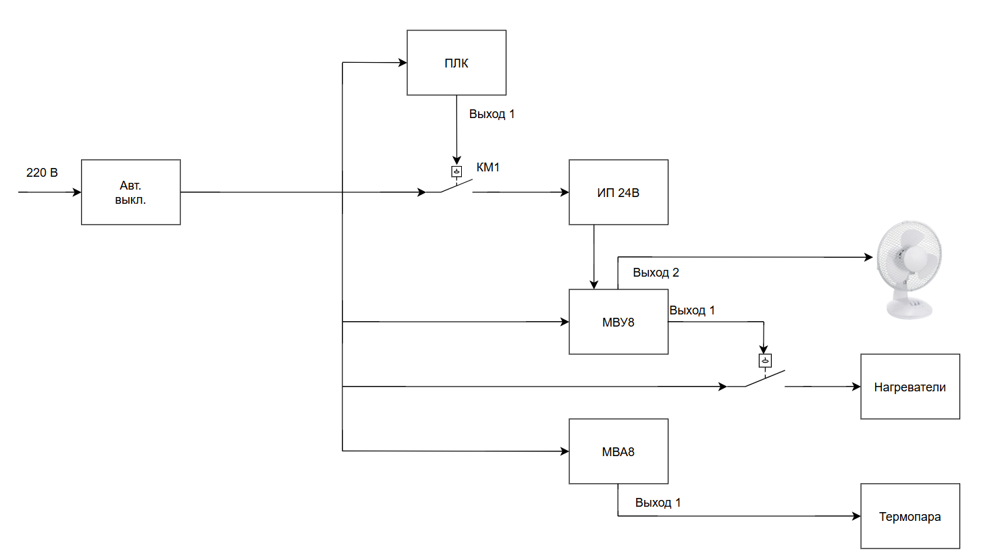

# PLC_first_steps
Быстрый старт для работы со стендом
## Стенд и его функционал

Элементы, которые расположены на стенде:
- [МВА8](https://owen.ru/uploads/38/rie_mva8_2172.pdf) - модуль ввода аналоговый измерительный;
- [МВУ8](https://owen.ru/uploads/re_mvu8-m01_1792.pdf) - модуль вывода;
- [Источник питания](https://www.farnell.com/datasheets/99831.pdf) - обеспечивает питанием 24 В;
- [ПЛК](https://owen.ru/uploads/re_plc100_1437.pdf) - ОВЕН ПЛК100;
- Нагреватели - питаются от 220 В и управляются 1 выводом на МВУ8;
- Вентилятор - подключён к МВУ8 и управляется 2 выводом;
- Термопара - подключена к 1 выводу МВА8;  
Так же можно управлять [магнитным пускателем](https://www.rlocman.ru/i/File/dat/ABB/Power_General_Purpose/A26_30_10_230V_50HZ.pdf) 1 выходом ПЛК. Помимо этого, для конфигурации на макете установлен [специальный конвертер с гальванической развязкой USB/RS-485/422](https://ironlogic.ru/il_new.nsf/htm/ru_usb485)
После знакомства со всеми компонентами переходим к [программированию](PLC_programming.md).