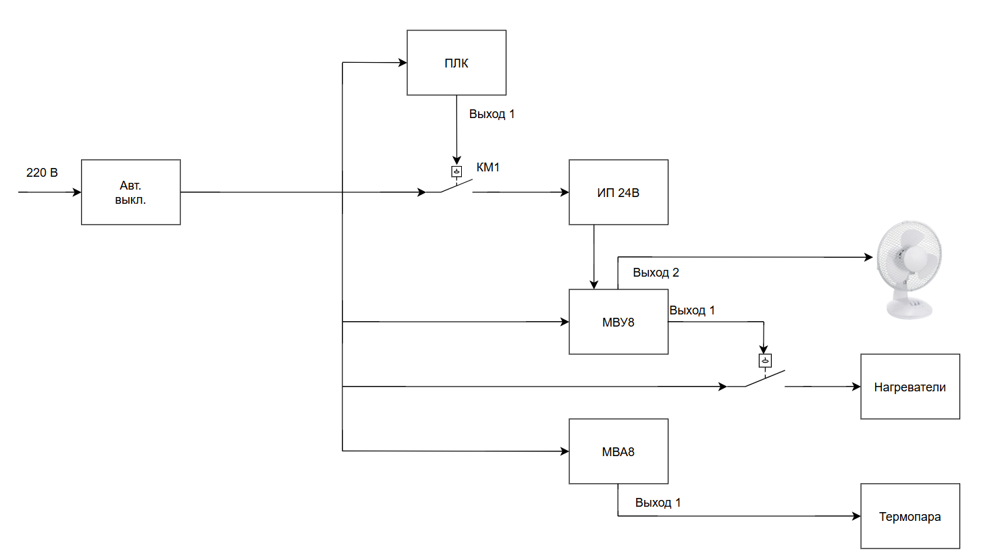

# PLC100 - Быстрый старт для работы со стендом Owen

## Состав стенда и функционал

### Основные компоненты системы:
1. **Модули ввода-вывода**:
   - [МВА8](https://owen.ru/uploads/38/rie_mva8_2172.pdf) - 8-канальный аналоговый измерительный модуль:
     - Напряжение: 220 В
     - Тип: P
     - Интерфейс: RS-485
   - [МВУ8](https://owen.ru/uploads/re_mvu8-m01_1792.pdf) - 8-канальный модуль дискретного вывода:
     - Напряжение: 220 В
     - Тип: P
     - Интерфейс: RS-485
2. **Система питания**:
   - [Источник питания 24V DC](https://www.farnell.com/datasheets/99831.pdf):
     - Преобразовывает напряжение: 220 В -> 24 В
3. **Контроллер**:
   - [ОВЕН ПЛК100](https://owen.ru/uploads/re_plc100_1437.pdf):
     - Процессор: 32-битный, 72 МГц
     - Память: 64 МБ Flash, 16 МБ RAM
     - Интерфейсы: 2×RS-485, Ethernet
4. **Исполнительные устройства**:
   - Нагревательные элементы:
     - Напряжение питания: 220 В AC
     - Управление: через 1-й канал МВУ8
   - Вентилятор охлаждения:
     - Напряжение питания: 24 В
     - Управление: 2-й канал МВУ8
   - [Магнитный пускатель ABB](https://www.rlocman.ru/i/File/dat/ABB/Power_General_Purpose/A26_30_10_230V_50HZ.pdf):
     - Управление: через дискретный выход ПЛК
5. **Датчики**:
   - Термопара:
     - Подключение: 1-й канал МВА8
6. **Коммуникационное оборудование**:
   - [Преобразователь интерфейса Z-397](https://ironlogic.ru/il_new.nsf/htm/ru_usb485):
     - Поддержка RS-485/422 
      
Переходим к [программированию контроллера](PLC_programming.md) для реализации алгоритмов управления.